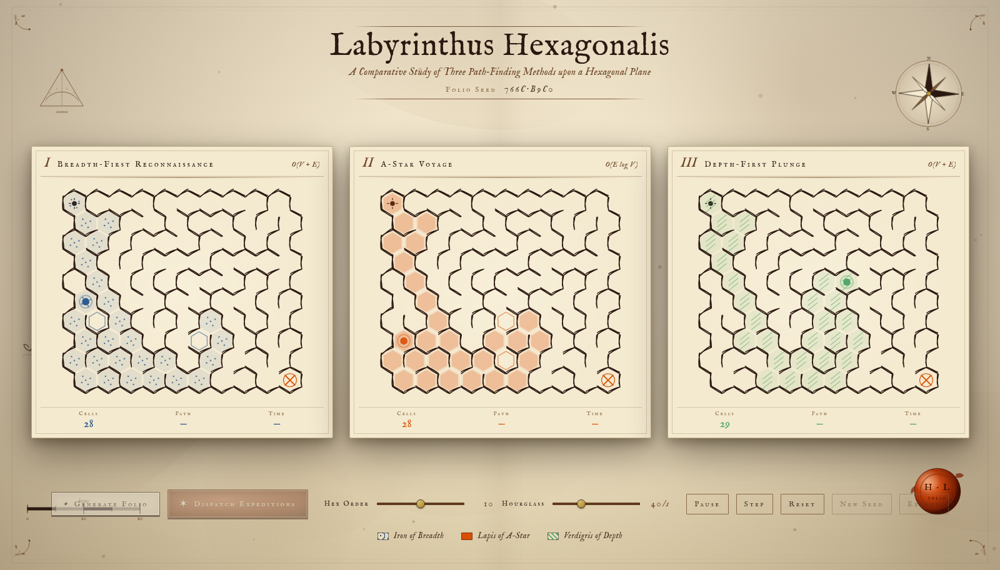
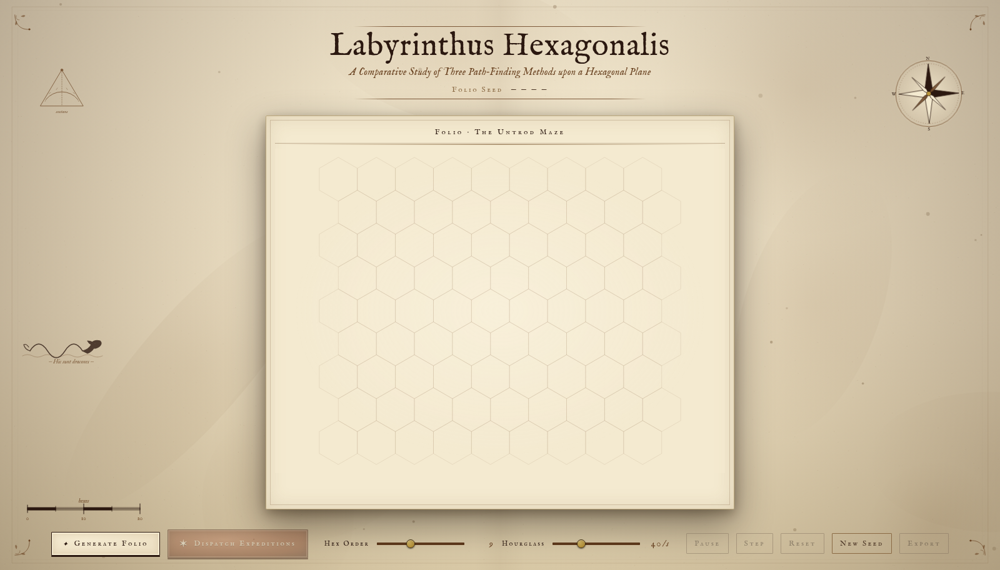
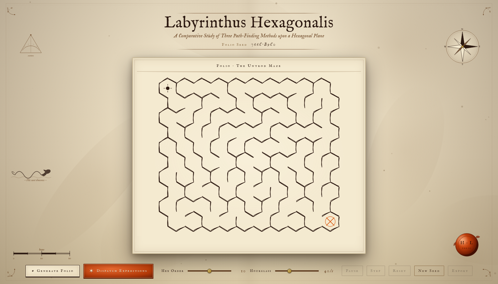
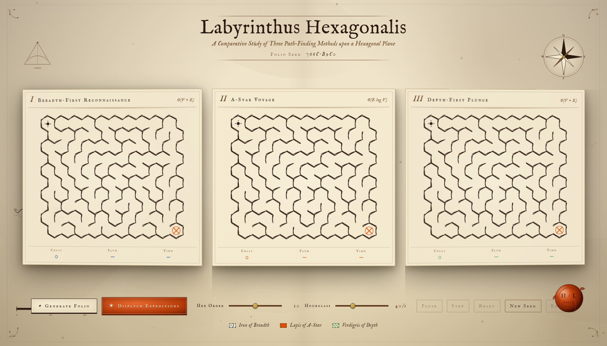
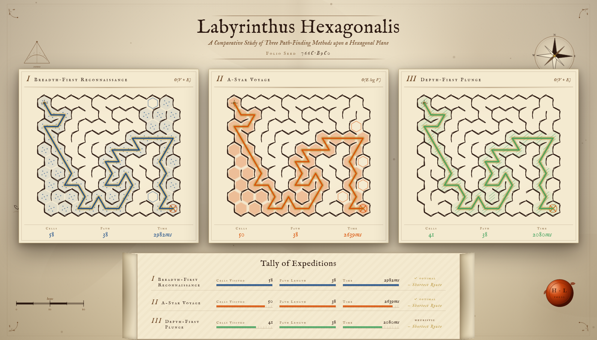
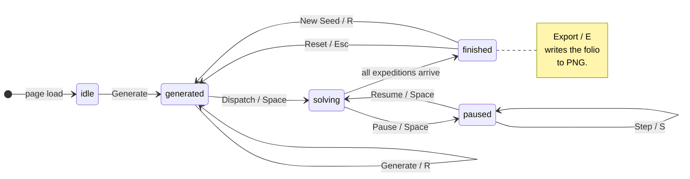
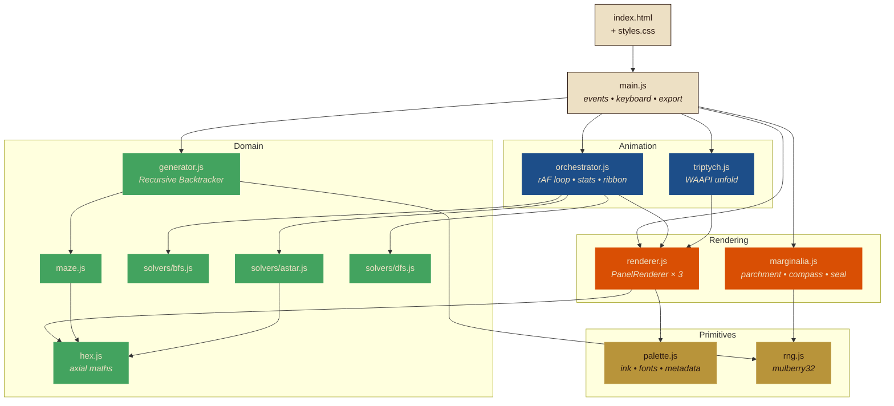
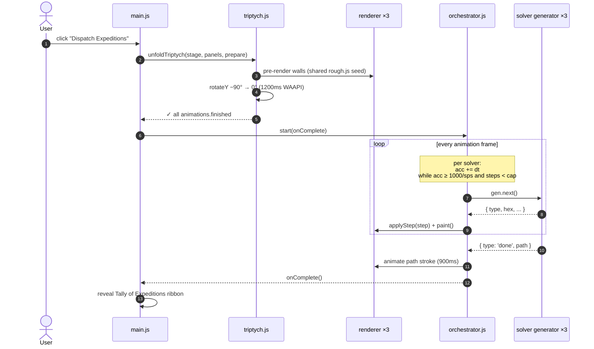

<div align="center">

# ✦ LABYRINTHUS HEXAGONALIS ✦

### *A Comparative Study of Three Path-Finding Methods upon a Hexagonal Plane*

> *Hic sunt algorithmi.* — Here be algorithms.

[](#-vii-architecture-of-the-folio)
[](#-xii-performance--accessibility)
[](#-iii-the-three-expeditions)
[](#-xi-typography-specimen)

<br />



<sub><em>The triptych mid-march — BFS in lapis, A&#42; in vermillion, DFS in verdigris.</em></sub>

</div>

---

A hex-maze generator and triple-solver visualiser drawn in the manner of an
antique cartographer's folio. The user generates a maze upon a single sheet
of vellum; upon dispatch, the page **unfolds into a triptych**, and three
rival expeditions — *Breadth-First Reconnaissance*, the *A-Star Voyage*, and
the *Depth-First Plunge* — march simultaneously across identical copies of
the labyrinth, each leaving a trail of its own ink.

The aesthetic is not decoration. The thesis of the folio is that
**algorithms have personalities and those personalities can be drawn.** The
folded-atlas metaphor, the per-ink fill patterns, the wax-seal stamp, the
gold-leaf "treasure" glow under each solution — all serve the comparison.

<br />

## ✦ Of This Folio

- **Three solvers race in parallel** on identical mazes, each in its own ink and fill pattern.
- **Pointy-top hex grid** addressed with axial coordinates — same maths, twice the aesthetic of a square grid.
- **Triptych unfold** via the Web Animations API — one panel becomes three, like opening a folded chart.
- **Procedural parchment** painted to canvas at load: fibre noise, tea stains, vignette, fold crease.
- **Hand-drawn linework** via `rough.js`, deterministically seeded so all three panels read as the same map.
- **No build step. No install.** Open `index.html` over any static HTTP server and it runs.
- **Reproducible**: every maze is generated from a single 32-bit *Folio Seed* printed in the cartouche.
- **Keyboard-driven**: every dock control has a one-key shortcut.

<br />

## ✦ A Curated Gallery

<table>
  <tr>
    <td width="50%" align="center"><b>I. The Untrod Folio</b><br /><sub>Empty page, hex grid as faint promise.</sub><br /><br />
      </td>
    <td width="50%" align="center"><b>II. A Maze Carved</b><br /><sub>Recursive Backtracker, wax seal, start &amp; goal marks.</sub><br /><br />
      </td>
  </tr>
  <tr>
    <td width="50%" align="center"><b>III. The Triptych Unfolds</b><br /><sub>Two panels rotate out from behind the centre.</sub><br /><br />
      </td>
    <td width="50%" align="center"><b>IV. Tally of Expeditions</b><br /><sub>Solution paths in each algorithm's ink; comparison ribbon.</sub><br /><br />
      </td>
  </tr>
</table>

<br />

## ✦ Table of the Folio

1. [Quick Embarkation](#-i-quick-embarkation)
2. [The Cycle of a Folio](#-ii-the-cycle-of-a-folio)
3. [The Three Expeditions](#-iii-the-three-expeditions)
4. [The Cartographer's Pen — Generation](#-iv-the-cartographers-pen--generation)
5. [Of Hexagons and Axial Coordinates](#-v-of-hexagons-and-axial-coordinates)
6. [Architecture of the Folio](#-vi-architecture-of-the-folio)
7. [Anatomy of a Solve](#-vii-anatomy-of-a-solve)
8. [The Controls of the Mariner](#-viii-the-controls-of-the-mariner)
9. [The Folio Seed](#-ix-the-folio-seed)
10. [The Palette of Inks](#-x-the-palette-of-inks)
11. [Typography Specimen](#-xi-typography-specimen)
12. [Performance & Accessibility](#-xii-performance--accessibility)
13. [Hic Sunt Dracones — Known Limits](#-xiii-hic-sunt-dracones--known-limits)
14. [Tools of the Trade](#-xiv-tools-of-the-trade)
15. [Marginalia](#-xv-marginalia)

---

## § I. Quick Embarkation

This is a single-page web application of vanilla HTML, CSS, and ES modules.
There is **no build step** and **no install**.

```sh
# from the project root
python3 -m http.server 8765
# then visit
open http://localhost:8765/
```

A static server is required only because ES modules cannot be loaded from
`file://`. Any HTTP server suffices — `python3 -m http.server`, `npx serve`,
`php -S`, `caddy file-server`, the Live Server VS Code extension, anything.
Once served, the folio runs entirely client-side; no network is consulted
save for two CDN resources fetched at load:

- **rough.js** — for the hand-drawn quality of every ink stroke.
- **IM Fell English** (and its small-caps companions) — the typeface, after
  Dr. John Fell.

Recommended browsers: any modern Chromium, Firefox, or Safari. Web Animations
API and Canvas 2D are the only non-trivial demands.

---

## § II. The Cycle of a Folio

Every folio passes through four states. Below, the full life of an
interaction, including the mariner's privileges to pause, step, and reset.



The state lives in `mode` inside `main.js`. The orchestrator's
`onComplete()` callback is what fires the `solving → finished` transition.

---

## § III. The Three Expeditions

Three algorithms race upon **the same maze**, in **the same instant**, that
their merits and follies be plainly compared. Each is given an ink colour
and a tactile fill pattern, so that the eye reads three personalities even
through a colour-blindness simulator.

| | Plate | Expedition | Ink | Pattern | Complexity | Optimal? |
|:--|:--:|---|:--:|---|---|:--:|
|  | I | Breadth-First Reconnaissance | Lapis | stippled dots | `O(V + E)` | ✓ |
|  | II | A-Star Voyage | Vermillion | solid wash | `O(E log V)` | ✓ (admissible heuristic) |
|  | III | Depth-First Plunge | Verdigris | diagonal hatch | `O(V + E)` | ✗ |

### Of Breadth-First Reconnaissance 

The Breadth-First explorer is patient and even-handed. From the start, it
expands outward in concentric rings, visiting every cell of distance *d*
before any cell of distance *d + 1*. Upon a uniform graph, it guarantees
the **shortest path** in number of steps. Its weakness is its impartiality:
it inspects great swathes of irrelevant territory before finding the goal.

```text
enqueue(start)
while queue not empty:
    cell ← dequeue()
    if cell == goal: reconstruct & return
    for each open neighbour:
        if not visited: visit, set parent, enqueue
```

### Of the A-Star Voyage 

A-Star is Breadth-First with a compass. Each cell is scored
`f(n) = g(n) + h(n)` — cost so far plus an estimate of the cost to the
goal. The estimate (heuristic) we employ is **the true hex distance on an
obstacle-free grid**, computed in axial coordinates:

```text
h(a, b) = (|aq − bq| + |ar − br| + |aq + ar − bq − br|) / 2
```

This heuristic is *admissible* (never overestimates) and *consistent*, so
A&#42; is guaranteed optimal. Visually, A&#42; drives directly toward the
goal in a focused plume, backtracking only when walls obstruct it. It
typically expands far fewer cells than BFS for the same answer.

> A binary heap is unnecessary at this scale; we use a sorted-insert array
> as the open set, which is faster in practice for ≤ 300 cells.

### Of the Depth-First Plunge 

Depth-First is bold and unwise. It commits to one branch at a time, plunging
along corridors until it can advance no further, then backtracking. It
**does not guarantee the shortest path**; it simply finds *a* path. On a
labyrinth carved by Recursive Backtracker (whose corridors are long and
winding), DFS will sometimes blunder into the goal swiftly, and sometimes
take a comically scenic route.

It is included not as a competitor but as a foil — to make the merits of
the other two legible.

---

## § IV. The Cartographer's Pen — Generation

The maze is carved by **Recursive Backtracker** (iterative form), the
algorithm which best suits the cartographic aesthetic: it produces long,
winding corridors with few junctions, like rivers etched onto an estuary.

```text
stack ← [start]
mark start visited
while stack not empty:
    cell ← top of stack
    if any unvisited neighbour exists:
        pick one at random
        carve passage; mark visited; push onto stack
    else:
        pop  (backtrack)
```

The choice of starting cell, the random pickings, *and* the rough.js stroke
jitter are **all driven by the same 32-bit Folio Seed** — given the same
seed, the same maze, drawn in the same hand, appears every time.

---

## § V. Of Hexagons and Axial Coordinates

Pointy-top hexagons are addressed with **axial coordinates** `(q, r)`
following the convention of Amit Patel's *Red Blob Games*. Two axes
suffice because the third is constrained by `s = −q − r`.

```text
       (q,  r−1)   (q+1, r−1)
              ╲     ╱
   (q−1, r) ──(q, r)── (q+1, r)
              ╱     ╲
       (q−1, r+1)  (q,  r+1)
```

We adopt one convention and adhere to it throughout `src/hex.js`:

- Direction `0` is the **East** neighbour. Subsequent directions advance
  **clockwise**: E, SE, SW, W, NW, NE.
- Vertex `0` is the **top-right** corner. Subsequent vertices advance
  clockwise.
- Edge `i` is shared with the neighbour in direction `i`. Carving a passage
  removes wall `i` on cell *A* and wall `(i + 3) mod 6` on the neighbour.

Pixel placement for a hex of size *s* (centre-to-vertex):

```text
x = s · √3 · (q + r/2)
y = s · 3/2 · r
```

Walls are stored as a **6-bit bitmask per cell** (`Uint8Array`). Every
operation that opens or closes a passage modifies both adjacent masks
symmetrically.

---

## § VI. Architecture of the Folio



### File layout

```
amaze/
├── index.html              # single entry point
├── styles.css              # parchment, type, dock, triptych transforms
├── README.md
├── screenshots/            # gallery shots referenced above
└── src/
    ├── main.js             # bootstrap, events, keyboard, export
    ├── palette.js          # ink colours, fonts, rough.js options, algo metadata
    ├── rng.js              # mulberry32 + Folio Seed formatting
    ├── hex.js              # axial math, neighbour table, pixel conversion
    ├── maze.js             # HexMaze class, walls bitmask, carve/has-wall
    ├── generator.js        # Recursive Backtracker (iterative generator)
    ├── solvers/
    │   ├── bfs.js          # generator yielding step descriptors
    │   ├── astar.js        # with sorted-insert priority queue
    │   └── dfs.js
    ├── renderer.js         # offscreen wall cache + per-algo fill patterns
    ├── marginalia.js       # parchment painter + compass / sextant / monster / seal
    ├── triptych.js         # WAAPI unfold + fold-back animations
    └── orchestrator.js     # rAF loop, step accumulator, ribbon population
```

Each module is small (under 200 lines). There are no implicit globals save
those introduced by rough.js (`window.rough`) and the browser.

### Step descriptors

Each solver is a JavaScript **generator function** that yields one of four
shapes. The renderer and the orchestrator both speak this protocol:

```js
yield { type: 'visit',         hex, parent };   // cell expanded
yield { type: 'frontier-add',  hex };           // queued / pushed
yield { type: 'frontier-pop',  hex };           // popped without visiting
yield { type: 'done',          path };          // path: hex[] or null
```

This is why the orchestrator can drive three different algorithms with a
single loop — it never sees a queue, a stack, or an open set.

---

## § VII. Anatomy of a Solve

What happens between the click of *Dispatch Expeditions* and the unfurling
of the *Tally* ribbon.



The orchestrator's loop **decouples algorithm pace from frame rate** with a
per-solver accumulator. The user's hourglass slider sets steps-per-second
directly; the loop is capped at six steps per frame to avoid death-spirals
on slow frames.

---

## § VIII. The Controls of the Mariner

| Dial / Button | Effect |
|---|---|
| **Generate Folio** | Carves a new maze under the current Folio Seed. |
| **Dispatch Expeditions** | Unfolds the triptych and races all three solvers. |
| **Pause / Resume** | Freezes or thaws every expedition mid-march. |
| **Step** | Advances each unfinished expedition by exactly one cell. |
| **Reset** | Folds the triptych back; the maze remains. |
| **New Seed** | Picks a fresh Folio Seed and regenerates. |
| **Export** | Saves the present folio as a PNG (titled with seed). |
| **Hex Order** | Side length of the rectangular hex field (6 – 14). |
| **Hourglass** | Solver step rate, 5 – 120 cells per second. |

Keyboard shortcuts mirror the dock:

<table>
  <tr><td align="center"><kbd>Space</kbd></td><td>solve · pause · resume</td></tr>
  <tr><td align="center"><kbd>S</kbd></td><td>single-step (while paused)</td></tr>
  <tr><td align="center"><kbd>G</kbd></td><td>generate</td></tr>
  <tr><td align="center"><kbd>R</kbd></td><td>regenerate with a new seed</td></tr>
  <tr><td align="center"><kbd>Esc</kbd></td><td>reset (fold the triptych back)</td></tr>
  <tr><td align="center"><kbd>E</kbd></td><td>export folio as PNG</td></tr>
</table>

---

## § IX. The Folio Seed

Every maze is born from a 32-bit unsigned integer, printed in the cartouche
in italic small caps:

```
   FOLIO SEED   3F1A·9C42
```

Given a seed, the maze, its start, its goal, and *even the precise jitter of
the ink* are reproducible. To share a curiosity with a fellow scholar, share
the seed.

The pseudo-random source is **mulberry32** — small, fast, deterministic,
and entirely sufficient for our purposes.

---

## § X. The Palette of Inks

All hues are derived from period-correct inks. The CSS custom properties at
the top of `styles.css` mirror these tokens exactly.

| | Token | Hex | Where it lives |
|:--:|---|---|---|
|  | `parchment`       | `#ede0c4` | Page base |
|  | `parchment-dark`  | `#c9b894` | Vignette, tea stains |
|  | `iron-gall`       | `#2b1810` | Walls, body text |
|  | `sepia`           | `#6b4423` | Marginalia, italic notes |
|  | `lapis`           | `#1d4e89` | BFS expedition |
|  | `vermillion`      | `#d94f04` | A&#42; expedition, wax seal |
|  | `verdigris`       | `#43a35f` | DFS expedition |
|  | `gold-leaf`       | `#b8943a` | Solution underglow, compass jewel |

The page itself is **procedurally painted** to a fixed canvas at load: a
warm tonal gradient, then thousands of translucent paper-fibre specks, then
half-a-dozen elliptical tea-stain blotches, then a corner vignette, then a
faint centre fold. This is regenerated on resize.

---

## § XI. Typography Specimen

| Role | Face |
|------|------|
| Display & body | **IM Fell English** (after Dr. John Fell, c. 1693) |
| Small caps | **IM Fell English SC** · **IM Fell DW Pica SC** |
| Italic annotations | **IM Fell English Italic** |
| Numerals | Oldstyle figures (`font-variant-numeric: oldstyle-nums`) |

> If a viewer's browser cannot render IM Fell English, the fallback
> (`Georgia, serif`) preserves the meaning if not the music.

---

## § XII. Performance & Accessibility

<details>
<summary><b>Why rough.js is seeded the same on all three panels</b></summary>

`rough.js` produces a different jitter on every call by default. For our
purpose this would be a sin: the three triptych panels must read as
**identical sheets of the same map**, not three separate drawings. We
therefore seed rough.js with the Folio Seed, so the jitter is bit-identical
across all three panels.

</details>

<details>
<summary><b>Why walls are cached offscreen</b></summary>

For performance, walls are rendered **once** to an offscreen canvas after
generation, and **blitted** to the live canvas each frame. Only the dynamic
state (visited cells, frontier, solution path, current head) is repainted
per frame. At ~250 hexes × 3 panels this holds 60 fps comfortably on
mid-range laptops.

</details>

<details>
<summary><b>Colour-blind safe: pattern as well as ink</b></summary>

Three inks would not suffice for a reader with colour-blindness, so each
expedition is also given a **distinct fill pattern**: stipple for BFS,
solid wash for A&#42;, diagonal hatch for DFS. The legend at the foot of
the page illustrates the swatch of each. Verified visually under
deuteranopia, protanopia, and tritanopia simulators.

</details>

<details>
<summary><b>The triptych unfold, in detail</b></summary>

When the user dispatches expeditions, the page does not simply replace one
panel with three. It **unfolds** as a folded atlas would: the centre panel
holds its position; two new sheets rotate out from behind it on the
horizontal axis (`rotateY` from ±90° to 0°), pivoting on the inner edge.
The shadow beneath each panel intensifies mid-fold for the impression of
paper being lifted. Below 1100 px viewport width, the same animation runs
**vertically** (`rotateX`), and the triptych stacks into a vertical scroll.

The walls of the side panels are **rendered before the animation starts**,
so the reveal shows real content rather than empty parchment.

</details>

---

## § XIII. Hic Sunt Dracones — Known Limits

- **Browser support.** Web Animations API is required; this excludes
  Internet Explorer and pre-2018 Edge. All modern browsers suffice.
- **Resize during solve.** The page is responsive between solves, but
  resizing mid-solve will cause the running expeditions to appear
  misaligned until reset. By design — the cost of pausing and recomputing
  every cell position each frame would not pay back its complexity.
- **Maze topology.** The grid is a rectangular hex footprint. Sphere-,
  torus-, and triangle-tiled mazes are left to a future folio.
- **Audio.** There is none. (A wax-seal *thunk* was considered and
  declined.)

---

## § XIV. Tools of the Trade

| Dependency | Purpose | License |
|---|---|---|
| [rough.js](https://roughjs.com/) — *Steve Ruiz et al.* | The hand-drawn texture of every wall and quill stroke. | MIT |
| [IM Fell English](https://fonts.google.com/specimen/IM+Fell+English) — *Igino Marini* | The typeface; digital revival of the types cut for Bishop John Fell in the late 1600s. | SIL Open Font License |

No other third-party code is used. The remainder is plain ES modules and
the Canvas 2D + Web Animations APIs.

---

## § XV. Marginalia

This folio was written to be **looked at**. The DAA substance — the three
algorithms, their complexities, their comparative tally — is genuine; the
antique frame around it is not decoration but the form of the argument.
*That algorithms have personalities, and that those personalities can be
drawn.*

<div align="center">

✦ &nbsp; · &nbsp; ❦ &nbsp; · &nbsp; ✦

<sub><em>Drawn in the year of our Lord MMXXVI.</em></sub>

</div>
